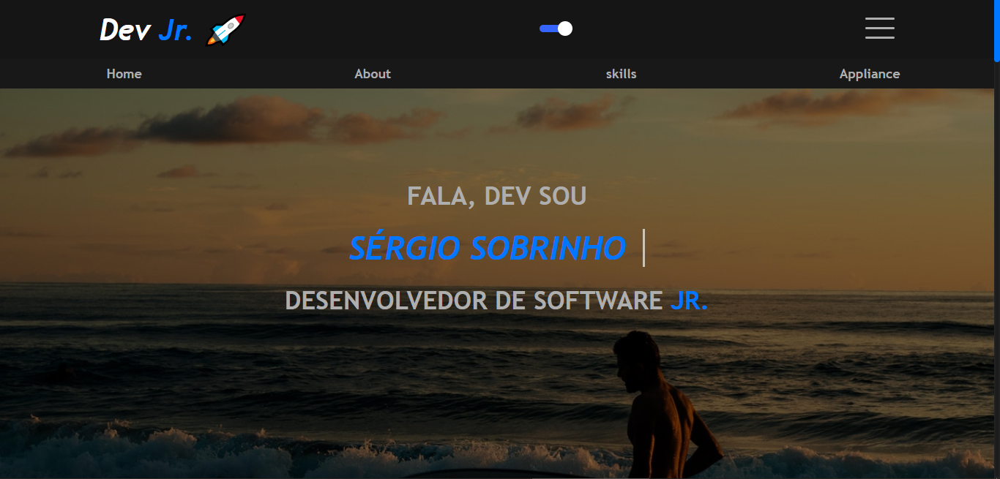
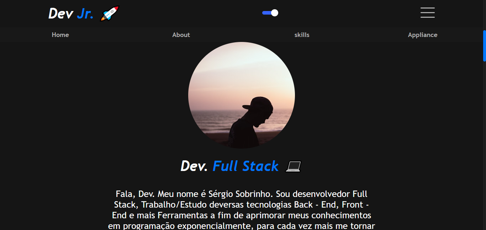

# Portifólio Web 🚀

Trata-se de um Portifólio Web, feito com intuito de estudar tecnologias Web tais como **ReactJs, TypeScriot, Styled-Components**

## Sobre o projeto 

O Projeto conta com várias seções, que tem como função organizar cada parte do site. O Web Site também está responsivo, assim se adequa a diferentes tipos de telas. E ainda, no final tem links para contato. 

## Tecnologias do projeto:

* 👉 
* 👉 
* 👉 

## O projeto: 

O Projeto está hospedado na Vercel, venha conferir! 

## Link do Projeto: 

<a href="https://profile-sergio-dev.vercel.app/">Profile Web</a>

## Agradecimento: 

Espero que tenha gostado do que eu desenvolvi, pois sou apaixonado por desenvolvimento Web e programação, busco cotidianamente crescer como profissional, para atender a crescente demanda exponencial numa área que eu amo.

## Contato:

 
 
 
 

